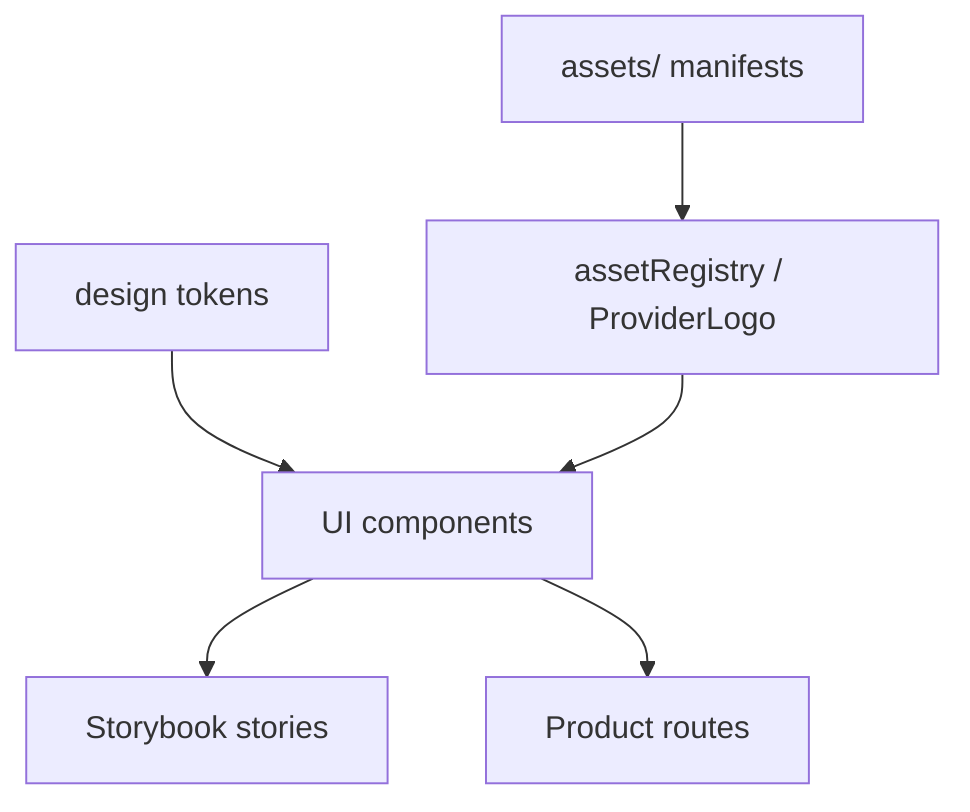

# Asset system

## Contract

VibeMaxxing has one asset source: the repository-level `assets/` library. Applications and UI stories consume stable semantic references; they do not own duplicate files. This follows the same separation used by mature product organizations: source assets, design tokens, reusable components, executable stories, and application composition each have a distinct owner.

## What belongs in the library

| Asset type | Canonical location | Consumer |
|---|---|---|
| Product brand | `assets/brand/` | `assetRegistry.brand` |
| AI provider/model marks | `assets/providers/` | `ProviderLogo` |
| Synthetic UI people | `assets/ui/fixtures/` | `assetRegistry.fixtures` |
| Future illustrations | `assets/illustrations/` | An illustration registry/component |
| Future flags | `assets/flags/` | A country-flag component |

Two categories deliberately do not become copied repository assets:

- Interface icons use the pinned `lucide-react` dependency so stroke, optical size, naming, accessibility, and upgrades stay consistent.
- Data visualizations are rendered from data and design tokens. A chart screenshot is review evidence, not source artwork.

## Layers and ownership

1. **Source file** — the canonical artwork or fixture in `assets/`.
2. **Collection manifest** — stable ID, path, provenance, allowed use, and replacement policy.
3. **Registry/component** — the only supported runtime reference.
4. **Storybook** — the executable inventory of sizes, states, contrast, and composition.
5. **Style guide** — the human-readable usage rules and examples.

This prevents route code from inventing provider symbols, downloading profile imagery, or diverging through near-identical copies.

## Naming

- Use lowercase kebab-case filenames.
- Name by identity or semantic job, not current screen or color.
- Avoid size suffixes for SVG source files.
- Platform-required raster exports may include dimensions.
- Preserve the path when artwork changes but meaning does not.
- Create a new ID/path when meaning changes.

## SVG rules

- Prefer a correct `viewBox`; do not encode presentation dimensions in source artwork.
- Remove scripts, external URLs, and unnecessary editor metadata.
- Keep official multicolor marks multicolor; do not force brand marks into a product accent.
- Provider assets require provenance and trademark guidance.
- SVGs containing raster fixture data are permitted only inside `assets/ui/fixtures/`.

## Accessibility

- Decorative marks use empty alt text and `aria-hidden`.
- Meaningful marks receive the registry label through their component.
- Never depend on a logo alone when the provider/model name is important.
- Do not put critical text inside an image.

## Governance

Every asset change must:

1. Update its collection manifest.
2. Preserve or intentionally migrate stable registry IDs.
3. Run the UI-system checks.
4. Render all affected Storybook stories.
5. Compare locked visual stories at the documented viewport.
6. Review licensing/provenance when the asset came from outside VibeMaxxing.

Feature-local asset folders are prohibited. Temporary exploration files stay outside product source and are either promoted into `assets/` with governance or discarded.
